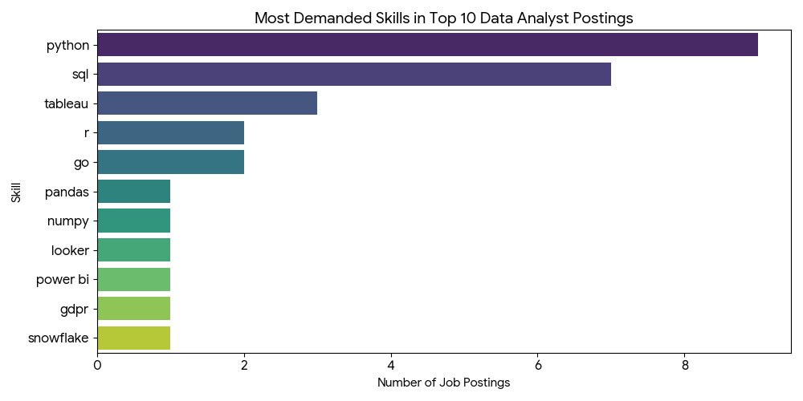

# Introduction
This project aims to analyse the data job market in Israel as per year 2023 and explores top-paying jobs, in-demand skills and also where high demand meets high salary in data analytics.

This project is for educational purposes only, intended to demonstrate basic knowledge of SQL and related tools. Data used in this project may be outdated or incorrect.

SQL queries link: [project_sql folder](/project_sql/)
# Background
One day I was surfing YouTube looking for educational videos on SQL when I came across this wonderful [tutorial](https://youtu.be/7mz73uXD9DA?si=csjTgcqKLYiRov1g). I would like to thank Luke Barousse and his [SQL Course](https://lukebarousse.com/sql) for inspiration for making this project.

### The questions I wanted to answer through my SQL queries were:
1. What are the top-paying data analyst jobs?
2. What skills are required for the top-paying data analyst jobs?
3. What are the most in-demand skills for data analysts?
4. What are the top skills based on salary?
5. What are the most optimal skills to learn?

# Tools I used
- **SQL:** A standard language used to communicate with databases.
- **PostgreSQL:** An advanced, free, and open-source relational database system.
- **Visual Studio Code:** A convenient tool for database management as well as executing SQL queries.
- **Git & GitHub:** Version control and project sharing.
- **Google Gemini 3.6:** A powerful and handy AI assistant I used to provide insights and trends based on query results.
# The Analysis
Each query for this project aimed at investigating specific aspects of the data analyst job market. Here is how I approached each question.
### Top-paying data analyst jobs
To identify the highest-paying roles I filtered Data Analyst positions by average yearly salary and location, focusing on jobs within Israel. This query highlights the high-paying opportunities in the field.
```sql
SELECT
    job_id,
    job_title,
    job_location,
    job_schedule_type,
    salary_year_avg,
    job_posted_date,
    name AS company_name
FROM
    job_postings_fact
LEFT JOIN
    company_dim 
    ON job_postings_fact.company_id = company_dim.company_id
WHERE
    job_title_short = 'Data Analyst'
    AND job_location LIKE '%Israel%'
    AND salary_year_avg IS NOT NULL
ORDER BY
    salary_year_avg DESC
LIMIT 10;
```
Here are a few quick insights from the top 10 data analyst jobs in Israel in 2023:

- **Geographic Concentration in Central High-Tech Hubs:** 70% of the postings are concentrated in Tel Aviv-Yafo, 
with the remaining 30% located in nearby central tech hubs (Herzliya and Ramat Hasharon).

- **Dominance of Cybersecurity & Scale-Up Unicorns:** Leading Israeli tech scale-ups and cybersecurity giants dominate hiring for these roles,with AppsFlyer and Armis Security accounting for multiple top positions, alongside major players like Wix, Riskified, and Similarweb.

- **Highly Standardized Compensation Packages:** 9 out of 10 listings share an identical annual salary benchmark of $111,175, 
indicating a tightly standardized compensation band across these top-tier Israeli roles regardless of specific domain focus (ranging from threat intelligence to marketing analytics).
### Top-paying data analyst job skills
To understand the highest-paying skills for data analyst roles I used a common table expression (CTE) to join the top-paying jobs from the first query.
```sql
WITH top_paying_jobs AS 
(   SELECT
        job_id,
        job_title,
        salary_year_avg,
        job_posted_date,
        name AS company_name
    FROM
        job_postings_fact
    LEFT JOIN
        company_dim 
        ON job_postings_fact.company_id = company_dim.company_id
    WHERE
        job_title_short = 'Data Analyst'
        AND job_location LIKE '%Israel%'
        AND salary_year_avg IS NOT NULL
    ORDER BY
        salary_year_avg DESC
    LIMIT 10
)

SELECT
    top_paying_jobs.*,
    skills_dim.skills
FROM 
    top_paying_jobs
JOIN skills_job_dim
    ON top_paying_jobs.job_id = skills_job_dim.job_id
JOIN skills_dim
    ON skills_job_dim.skill_id = skills_dim.skill_id
ORDER BY
    salary_year_avg;
```
Key Insights & Skill Breakdown

- **Core Technical Languages Lead the Pack:**
Python (90% demand): Python appears in 9 out of 10 job postings, making it the single most requested skill in this dataset. SQL (70% demand): SQL is required in 7 out of 10 postings, reinforcing its position as the foundational baseline for querying databases.

- **Business Intelligence & Data Visualization:**
Tableau (30% demand): Leads among BI tools in this dataset, appearing in 3 job postings. Looker & Power BI (10% each): Each appears once across the listings, showing diversity in organization-specific BI stacks.

- **Specialized & Niche Skills:** Statistical Programming: R appears in 2 job listings (20%). Backend / Systems: Go appears in 2 job listings (20%). Data Engineering & Libraries: Pandas, NumPy, Snowflake, and compliance standards like GDPR each appear once.


*Bar graph visualizing the most demanding skills in top 10 data analyst postings in Israel, 2023. Generated by Google Gemini from my SQL query result*

### Top demanding skills for data analyst roles
To spot the highest-demand skills I aggregated and grouped skills focusing on those required for Data Analyst jobs within Israel. This query provides insights into the most valuable skills for job seekers.
```sql
SELECT 
    skills,
    count(skills_job_dim.job_id) AS demand_count
FROM
    job_postings_fact
JOIN 
    skills_job_dim ON job_postings_fact.job_id = skills_job_dim.job_id
JOIN 
    skills_dim ON skills_job_dim.skill_id = skills_dim.skill_id
WHERE
    job_title_short = 'Data Analyst'
    AND job_location LIKE '%Israel%'
GROUP BY
    skills
ORDER BY
    demand_count DESC
LIMIT 10;
```
- **SQL & Python Lead by a Wide Margin:** SQL (628 postings) and Python (395 postings) are the dominant skill requirements, appearing far more frequently than any other technology.

- **Visualization Tools:** Tableau (243) is the most requested BI tool, followed by Power BI (118) and Looker (94).

- **Core Spreadsheet Baseline:** Excel (171) remains a core requirement across many postings, outranking specialized analytical packages like Pandas (60) and cloud platforms like AWS (46) and Snowflake (45).


*Bar graph visualizing the most demanding skills filtered for data analyst roles in Israel, 2023. Generated by Google Gemini from my SQL query result*

| Skill | Demand Count |
| :--- | :---: |
| SQL | 628 |
| Python | 395 |
| Tableau | 243 |
| Excel | 171 |
| Power BI | 118 |
| Looker | 94 |
| R | 85 |
| Pandas | 60 |
| AWS | 46 |
| Snowflake | 45 |

###  The top skills based on salary
For this particular query I aggregated average salary as per skill filtered by Data Analyst jobs in Israel. The result helps identify the most financially rewarding skills to acquire or improve.
```sql
SELECT 
    skills,
    ROUND(AVG(salary_year_avg), 0) AS avg_salary
FROM
    job_postings_fact
JOIN 
    skills_job_dim ON job_postings_fact.job_id = skills_job_dim.job_id
JOIN 
    skills_dim ON skills_job_dim.skill_id = skills_dim.skill_id
WHERE
    job_title_short = 'Data Analyst'
    AND job_location LIKE '%Israel%'
    AND salary_year_avg IS NOT NULL
GROUP BY
    skills
ORDER BY
    avg_salary DESC
LIMIT 25;
```
| Skill | Average Salary (USD) |
| :--- | :---: |
| GDPR | $111,175 |
| Snowflake | $111,175 |
| R | $108,088 |
| NumPy | $105,000 |
| Pandas | $105,000 |
| Jupyter | $100,500 |
| Python | $99,807 |
| Elasticsearch | $98,500 |
| Go | $95,091 |
| Tableau | $93,324 |
| Power BI | $93,196 |
| SQL | $92,344 |
| Looker | $82,095 |
| Excel | $79,007 |
| NoSQL | $72,000 |
| AWS | $53,014 |
| BigQuery | $53,014 |

- **Enterprise Compliance & Cloud Warehousing Command Top Dollar:** Governance and cloud infrastructure lead the market, 
with GDPR and Snowflake tied at the highest average salary ($111,175), reflecting high compensation for data privacy compliance 
and enterprise architecture.

- **Data Science & Python Ecosystem Outpaces Traditional BI:** Programmatic and statistical tools (R at $108,088, Pandas/NumPy at $105,000, 
and Python at $99,807) consistently pay more than traditional reporting tools like Tableau ($93,324), Power BI ($93,196), SQL ($92,344), 
and Excel ($79,007).

- **High Salary Floor for Core Analytics vs. Utility Cloud Terms:** Most specialized data tools cluster firmly between $80,000 and $111,000, 
while broad cloud keywords like AWS and BigQuery sit at the lower end ($53,014), likely due to their frequent inclusion in lower-level 
or junior job descriptions.

### What are the most optimal skills to learn
To identify skills in high demand and associated with high average salaries for Data Analyst roles within Israel. This targets skills that offer job securiry (high demand) and financial benefits (high salaries), offering strategic insights for career development in data analysis.
```sql
WITH skills_demand AS
(    SELECT 
        skills_dim.skill_id,
        skills_dim.skills,
        count(skills_job_dim.job_id) AS demand_count
    FROM
        job_postings_fact
    JOIN skills_job_dim ON job_postings_fact.job_id = skills_job_dim.job_id
    JOIN skills_dim ON skills_job_dim.skill_id = skills_dim.skill_id
    WHERE
        job_title_short = 'Data Analyst'
        AND salary_year_avg IS NOT NULL
        AND job_location LIKE '%Israel%'
    GROUP BY
        skills_dim.skill_id
), average_salary AS
(    SELECT 
        skills_job_dim.skill_id,
        ROUND(AVG(salary_year_avg), 0) AS avg_salary
    FROM
        job_postings_fact
    JOIN skills_job_dim ON job_postings_fact.job_id = skills_job_dim.job_id
    JOIN skills_dim ON skills_job_dim.skill_id = skills_dim.skill_id
    WHERE
        job_title_short = 'Data Analyst'
        AND salary_year_avg IS NOT NULL
        AND job_location LIKE '%Israel%'
    GROUP BY
        skills_job_dim.skill_id
)

SELECT
    skills_demand.skill_id,
    skills_demand.skills,
    demand_count,
    avg_salary
FROM
    skills_demand
JOIN average_salary ON skills_demand.skill_id = average_salary.skill_id
ORDER BY
    demand_count DESC, avg_salary DESC;
```
I also have a more concise version of this query:
```sql
SELECT
    skills_dim.skill_id,
    skills_dim.skills,
    COUNT(skills_job_dim.job_id) AS demand_count,
    ROUND(AVG(salary_year_avg),0) AS avg_salary
FROM
    job_postings_fact
JOIN skills_job_dim ON job_postings_fact.job_id = skills_job_dim.job_id
JOIN skills_dim ON skills_job_dim.skill_id = skills_dim.skill_id
WHERE
    job_title_short = 'Data Analyst'
    AND salary_year_avg IS NOT NULL
    AND job_location LIKE '%Israel%'
GROUP BY
    skills_dim.skill_id
HAVING
    COUNT(skills_job_dim.job_id) > 1
ORDER BY
    demand_count DESC, avg_salary DESC;
```


*A visualization of skills in high demand and associated with high average salaries for Data Analyst roles within Israel. Generated by Google Gemini from my SQL query result*

- **SQL & Python Dominate Demand:** SQL (17 postings) and Python (14 postings) are by far the most demanded skills in this dataset, while maintaining strong average salaries of $92,344 and $99,807, respectively.

- **R Commands the Highest Average Salary:** Despite lower demand frequency (2 postings), R leads in compensation with an average salary of $108,088.

- **BI Tools Balance Demand and Compensation:** Tableau leads among business intelligence tools in demand count (6 postings, $93,324 avg. salary), followed by Go (4 postings, $95,091), while Power BI, Looker, and Excel round out the list.

# What I Learned
- SQL basic and advanced syntax and functions that are used for retrieving data from relational databases.
- Setting a local database using tools like Visual Studio Code and PostgresQL.
- Connecting Git and creating my first repository on GitHub.
- Using AI as a valuable work assistant.
# Conclusions

* **SQL and Python Are the Core Foundation:** **SQL** and **Python** are the uncontested core requirements for data analysts. SQL commands the highest volume of overall job listings (appearing 1.6x more often than Python in global demand datasets), while Python yields higher average compensation and dominates advanced analytics workflows.

* **Advanced Engineering & DevOps Command the Highest Salaries:** Specialized skills that bridge data analysis with data engineering, cloud architecture, and DevOps—such as **Snowflake**, **Couchbase**, **Go**, **Terraform**, and **Kafka**—consistently pay higher average salaries ($115,000–$160,000+) than standard reporting tools.


* **Standardized High Salary Baseline in Israel's High-Tech Market:** In top-tier Israeli tech companies (located primarily in central hubs like **Tel Aviv-Yafo** and **Herzliya**), compensation is tightly standardized around **~$111,175 USD** across diverse analytical domains, from marketing and product to threat intelligence.


* **Visualization Tools Are Essential, Led by Tableau:** **Tableau** leads the business intelligence category in overall demand count, followed by **Power BI** and **Looker**. While necessary for day-to-day corporate reporting, pure BI tools generally sit at lower salary tiers compared to programmatic data science libraries (**Pandas**, **NumPy**, **R**).


* **Niche & Governance Expertise Unlocks Top-Tier Pay:** Highly specialized domains—such as data privacy regulation (**GDPR**) in regional markets or blockchain analytics (**Solidity**) globally—drive top-of-market compensation, proving that domain-specific expertise carries a strong premium.
